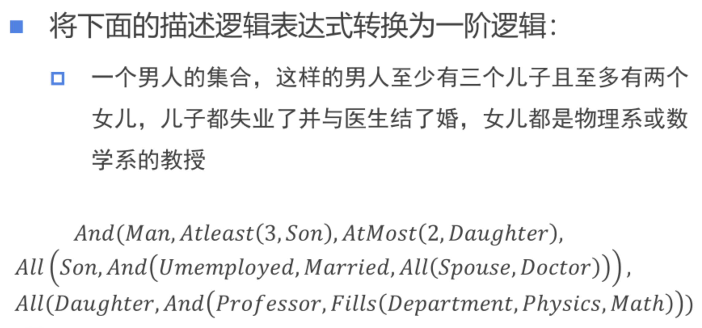

# homework10

## 问题一

要将这个描述逻辑表达式转换为一阶逻辑，我们需要将每个概念和关系用一阶逻辑的量词和谓词表示。下面是转换后的一阶逻辑表达式：

1. 对于所有的男人 \( x \)，如果 \( x \) 是一个男人，那么：
   - \( x \) 至少有三个儿子。
   - \( x \) 至多有两个女儿。
   - 对于 \( x \) 的所有儿子 \( y \)，\( y \) 是失业的，并且 \( y \) 与医生结婚。
   - 对于 \( x \) 的所有女儿 \( z \)，\( z \) 是教授，并且 \( z \) 所在的系是物理系或数学系。

用一阶逻辑表示如下：

当然可以，下面是换行后的一阶逻辑表达式，以提高可读性：

\[
\forall x (Man(x) \rightarrow 
    (\exists y_1, y_2, y_3 (Son(x, y_1) \land Son(x, y_2) \land Son(x, y_3) \\
    \land \forall z (Son(x, z) \rightarrow (y_1 = z \lor y_2 = z \lor y_3 = z)))) \\
    \land (\forall w (Daughter(x, w) \rightarrow \exists u, v (Daughter(x, u) \land Daughter(x, v) \land (w = u \lor w = v)))) \\
    \land \forall y (Son(x, y) \rightarrow Unemployed(y) \land \exists z (Married(y, z) \land Doctor(z))) \\
    \land \forall z (Daughter(x, z) \rightarrow Professor(z) \land (Department(z, Physics) \lor Department(z, Math))))
\]

这个表达式中：
- \( \forall \) 表示全称量词，意味着“对于所有”。
- \( \exists \) 表示存在量词，意味着“存在”。
- \( \rightarrow \) 表示逻辑蕴含，即“如果...那么...”。
- \( \land \) 表示逻辑与，即“并且”。
- \( \lor \) 表示逻辑或，即“或者”。
- \( Son(x, y) \) 表示 \( y \) 是 \( x \) 的儿子。
- \( Daughter(x, z) \) 表示 \( z \) 是 \( x \) 的女儿。
- \( Unemployed(y) \) 表示 \( y \) 是失业的。
- \( Married(y, z) \) 表示 \( y \) 与 \( z \) 结婚。
- \( Doctor(z) \) 表示 \( z \) 是医生。
- \( Professor(z) \) 表示 \( z \) 是教授。
- \( Department(z, Physics) \) 表示 \( z \) 在物理系工作。
- \( Department(z, Math) \) 表示 \( z \) 在数学系工作。

这个一阶逻辑表达式准确地反映了原始描述逻辑表达式中的所有条件。
