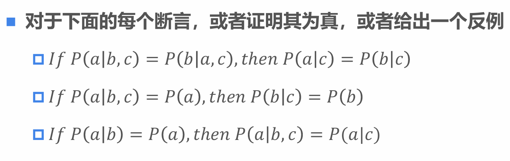

# homework12

## 问题一

1. 首先分析第一个断言：
   - 断言为：If \(P(a|b, c) = P(b|a, c)\), then \(P(a|c) = P(b|c)\)
   - 证明：
     - 根据贝叶斯定理，\(P(a|b, c)=\frac{P(a, b, c)}{P(b, c)}\)，\(P(b|a, c)=\frac{P(a, b, c)}{P(a, c)}\)
     - 已知\(P(a|b, c) = P(b|a, c)\)，即\(\frac{P(a, b, c)}{P(b, c)}=\frac{P(a, b, c)}{P(a, c)}\)
     - 由此可得\(P(a, c) = P(b, c)\)
     - 再根据条件概率的定义，\(P(a|c)=\frac{P(a, c)}{P(c)}\)，\(P(b|c)=\frac{P(b, c)}{P(c)}\)
     - 因为\(P(a, c) = P(b, c)\)，所以\(P(a|c) = P(b|c)\)
   - 所以第一个断言是正确的。

2. 接着分析第二个断言：
   - 断言为：If \(P(a|b, c) = P(a)\), then \(P(b|c) = P(b)\)
   - 证明：
     - 已知\(P(a|b, c) = P(a)\)，根据条件概率的定义\(P(a|b, c)=\frac{P(a, b, c)}{P(b, c)}\)
     - 即\(\frac{P(a, b, c)}{P(b, c)} = P(a)\)，所以\(P(a, b, c)=P(a)P(b, c)\)
     - 再根据贝叶斯定理\(P(b|c)=\frac{P(b, c)}{P(c)}\)
     - 但是无法从\(P(a, b, c)=P(a)P(b, c)\)推出\(P(b|c) = P(b)\)
     - 反例：
       - 设掷一个均匀的六面骰子。令事件\(a\)为“骰子的点数是偶数”；事件\(b\)为“骰子的点数小于等于3”；事件\(c\)为“骰子的点数大于1”。
       - 首先计算\(P(a|b,c)\)：
         - \(P(a\cap b\cap c)\)表示骰子的点数是偶数、小于等于3并且大于1，即\(a\cap b\cap c=\{2\}\)，所以\(P(a\cap b\cap c)=\frac{1}{6}\)。
         - \(P(b\cap c)\)表示骰子的点数小于等于3并且大于1，即\(b\cap c = \{2,3\}\)，所以\(P(b\cap c)=\frac{2}{6}=\frac{1}{3}\)。
         - 根据条件概率公式\(P(a|b,c)=\frac{P(a\cap b\cap c)}{P(b\cap c)}=\frac{\frac{1}{6}}{\frac{2}{6}}=\frac{1}{2}\)。
         - 而\(P(a)=\frac{3}{6}=\frac{1}{2}\)，所以\(P(a|b,c) = P(a)\)成立。
       - 接着计算\(P(b|c)\)：
         - \(P(b\cap c)=\frac{2}{6}=\frac{1}{3}\)（前面已计算）。
         - \(P(c)=\frac{5}{6}\)。
         - 根据条件概率公式\(P(b|c)=\frac{P(b\cap c)}{P(c)}=\frac{\frac{2}{6}}{\frac{5}{6}}=\frac{2}{5}\)。
         - 而\(P(b)=\frac{3}{6}=\frac{1}{2}\)，所以\(P(b|c)\neq P(b)\)。
   - 所以第二个断言是错误的。

3. 最后分析第三个断言：
   - 断言为：If \(P(a|b) = P(a)\), then \(P(a|b, c) = P(a|c)\)
   - 证明：
     - 已知\(P(a|b) = P(a)\)，说明\(a\)和\(b\)是独立事件，即\(P(a, b)=P(a)P(b)\)
     - 根据条件概率的定义\(P(a|b, c)=\frac{P(a, b, c)}{P(b, c)}\)
     - 但是无法从\(P(a, b)=P(a)P(b)\)推出\(P(a|b, c) = P(a|c)\)
     - 反例：
       - 设掷一个六面的骰子。事件\(a\)：骰子的点数是奇数；事件\(b\)：骰子的点数小于等于4；事件\(c\)：骰子的点数为1或6。
       - 可以计算出\(P(a|b) = P(a) = \frac{1}{2}\)，但是\(P(a|b, c) = 1\)，\(P(a|c) = \frac{1}{2}\)，二者并不相等。
   - 所以第三个断言是错误的。

综上：
- 第一个断言是正确的。
- 第二个断言是错误的。
- 第三个断言是错误的。
 

## 问题二

### 一、首先，明确问题
乘法规则是概率论中的一个基本概念，用于计算两个事件同时发生的概率。条件化版本的乘法规则是指在给定第三个事件 \( e \) 的条件下，两个事件 \( X \) 和 \( Y \) 同时发生的概率。公式如下：

\[ P(X, Y | e) = P(X | Y, e)P(Y | e) \]

这个公式的意思是，在事件 \( e \) 发生的条件下，事件 \( X \) 和 \( Y \) 同时发生的概率等于在 \( Y \) 和 \( e \) 都发生的条件下 \( X \) 发生的概率，乘以在 \( e \) 发生的条件下 \( Y \) 发生的概率。

### 二、回顾条件概率的定义
   - 条件概率的定义为：\(P(A|B)=\frac{P(A \cap B)}{P(B)}\)，其中\(P(B)>0\)。
    
### 三、从左到右证明等式
   - 从左边开始：\(P(X, Y|e)\)
     - 根据条件概率的定义，\(P(X, Y|e)=\frac{P(X, Y, e)}{P(e)}\)。
   - 现在看右边：\(P(X|Y, e)P(Y|e)\)
     - 首先，\(P(X|Y, e)=\frac{P(X, Y, e)}{P(Y, e)}\)，\(P(Y|e)=\frac{P(Y, e)}{P(e)}\)。
     - 将这两个式子相乘：
       - \(P(X|Y, e)P(Y|e)=\frac{P(X, Y, e)}{P(Y, e)}\cdot\frac{P(Y, e)}{P(e)}=\frac{P(X, Y, e)}{P(e)}\)。

### 四、比较左右两边
   - 左边：\(P(X, Y|e)=\frac{P(X, Y, e)}{P(e)}\)
   - 右边：\(P(X|Y, e)P(Y|e)=\frac{P(X, Y, e)}{P(e)}\)
   - 左右两边相等，证明完成。

因此，\(P(X, Y|e) = P(X|Y, e)P(Y|e)\)得证。

