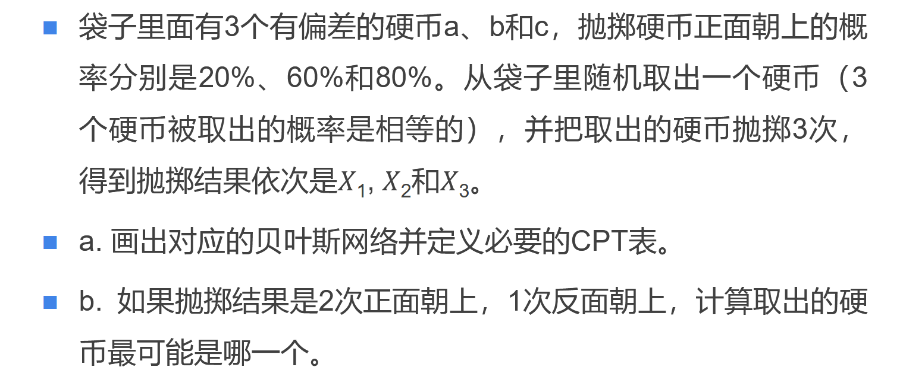

<!--
 * @Author: shysgsg 1054733568@qq.com
 * @Date: 2025-01-10 16:15:13
 * @LastEditors: shysgsg 1054733568@qq.com
 * @LastEditTime: 2025-01-10 16:32:56
 * @FilePath: \人工智能\homework\homework13\homework13.md
 * @Description: 这是默认设置,请设置`customMade`, 打开koroFileHeader查看配置 进行设置: https://github.com/OBKoro1/koro1FileHeader/wiki/%E9%85%8D%E7%BD%AE
-->
# homework13

## 问题

## 解答
### 一、贝叶斯网络及CPT表
- **贝叶斯网络**：
    - 首先构建一个简单的贝叶斯网络结构。有一个根节点表示“取出的硬币”，它有三个状态：a、b、c，且每个状态的先验概率相等，即$P(取出的硬币 = a) = P(取出的硬币 = b) = P(取出的硬币 = c)=\frac{1}{3}$。
    - 从“取出的硬币”这个根节点分别引出三条有向边到三个子节点$X_1$、$X_2$、$X_3$，这三个子节点分别表示三次抛掷硬币的结果，每个子节点的取值为正面（heads，简称H）或反面（tails，简称T）。
- **CPT表（条件概率表）**：
    - 对于硬币a：
        - 当取出的硬币是a时，每次抛掷硬币正面朝上的概率为$P(X_i = H | 取出的硬币 = a) = 0.2$，那么反面朝上的概率就是$P(X_i = T | 取出的硬币 = a) = 1 - 0.2 = 0.8$（这里的$i = 1,2,3$，表示三次抛掷中的任意一次）。
    - 对于硬币b：
        - 同理，当取出的硬币是b时，$P(X_i = H | 取出的硬币 = b) = 0.6$，$P(X_i = T | 取出的硬币 = b) = 1 - 0.6 = 0.4$。
    - 对于硬币c：
        - 当取出的硬币是c时，$P(X_i = H | 取出的硬币 = c) = 0.8$，$P(X_i = T | 取出的硬币 = c) = 1 - 0.8 = 0.2$。

### 二、计算取出的硬币最可能是哪一个（已知抛掷结果是2次正面朝上，1次反面朝上）
- **基本原理**：
    - 根据贝叶斯公式$P(C|D)=\frac{P(D|C)P(C)}{P(D)}$，其中$C$表示“取出的硬币是某一种”（这里分别是a、b、c），$D$表示“抛掷结果是2次正面朝上，1次反面朝上”。由于分母$P(D)$对于三种硬币的计算是相同的，所以我们可以先不计算分母，只计算分子$P(D|C)P(C)$，最后通过比较它们的大小来确定哪种硬币的后验概率最大，即最有可能是取出的硬币。
    - 又因为$P(C)=\frac{1}{3}$（三个硬币被取出的概率相等），所以实际上只需要比较$P(D|C)$的大小即可。
- **计算过程**：
    - **对于硬币a**：
        - 要得到抛掷结果是2次正面朝上，1次反面朝上的情况，从三次抛掷结果中选2次正面朝上的组合数为$C_{3}^{2}=\frac{3!}{2!(3 - 2)!}=3$种。
        - 当取出的硬币是a时，每次抛掷正面朝上的概率是0.2，反面朝上的概率是0.8。所以出现2次正面朝上，1次反面朝上的概率为：
        - $P(2heads,1tails|C = a)=C_{3}^{2}×0.2^2×0.8^1 = 3×0.04×0.8 = 0.096$
    - **对于硬币b**：
        - 同样，从三次抛掷结果中选2次正面朝上的组合数为$C_{3}^{2}=3$种。
        - 当取出的硬币是b时，每次抛掷正面朝上的概率是0.6，反面朝上的概率是0.4。所以出现2次正面朝上，1次反面朝上的概率为：
        - $P(2heads,1tails|C = b)=C_{3}^{2}×0.6^2×0.4^1 = 3×0.36×0.4 = 0.432$
    - **对于硬币c**：
        - 从三次抛掷结果中选2次正面朝上的组合数还是$C_{3}^{2}=3$种。
        - 当取出的硬币是c时，每次抛掷正面朝上的概率是0.8，反面朝上的概率是0.2。所以出现2次正面朝上，1次反面朝上的概率为：
        - $P(2heads,1tails|C = c)=C_{3}^{2}×0.8^2×0.2^1 = 3×0.64×0.2 = 0.384$
- **比较与结论**：
    - 比较$P(2heads,1tails|C = a)=0.096$，$P(2heads,1tails|C = b)=0.432$，$P(2heads,1tails|C = c)=0.384$的大小，可得$0.432＞0.384＞0.096$。
    - 所以，当抛掷结果是2次正面朝上，1次反面朝上时，取出的硬币最可能是b。

