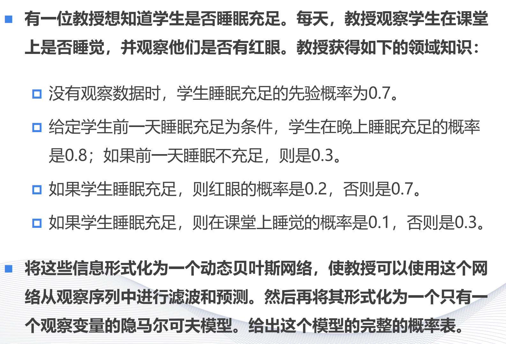
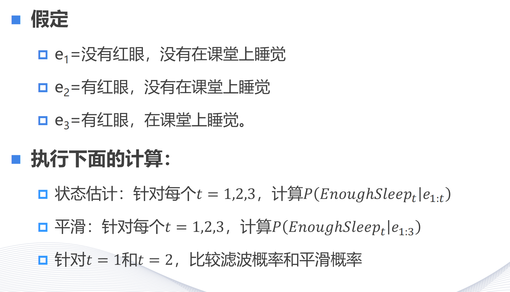

<!--
 * @Author: shysgsg 1054733568@qq.com
 * @Date: 2024-12-31 09:27:31
 * @LastEditors: shysgsg 1054733568@qq.com
 * @LastEditTime: 2025-01-10 16:32:12
 * @FilePath: \人工智能\homework\homework14\homework14.md
 * @Description: 这是默认设置,请设置`customMade`, 打开koroFileHeader查看配置 进行设置: https://github.com/OBKoro1/koro1FileHeader/wiki/%E9%85%8D%E7%BD%AE
-->
# homework14

## 问题一

1. 首先，定义变量：
   - 令\(S\)表示学生睡眠充足事件，\(\neg S\)表示学生睡眠不充足事件。
   - 令\(R\)表示学生有红眼事件，\(\neg R\)表示学生没有红眼事件。
   - 令\(C\)表示学生在课堂上睡觉事件，\(\neg C\)表示学生在课堂上不睡觉事件。

2. 根据题目中的条件概率：
   - \(P(S) = 0.7\)（没有观察数据时，学生睡眠充足的先验概率）
   - \(P(S|\text{前一天睡眠充足}) = 0.8\)，\(P(S|\text{前一天睡眠不充足}) = 0.3\)
   - \(P(R|S) = 0.2\)，\(P(R|\neg S) = 0.7\)
   - \(P(C|S) = 0.1\)，\(P(C|\neg S) = 0.3\)

3. 构建HMM的概率表：
   - 初始状态概率：
     - \(P(S) = 0.7\)
     - \(P(\neg S) = 1 - 0.7 = 0.3\)
   - 状态转移概率：
     - \(P(S_{t + 1}|S_t) = 0.8\)（如果前一天睡眠充足，当天睡眠充足的概率）
     - \(P(S_{t + 1}|\neg S_t) = 0.3\)（如果前一天睡眠不充足，当天睡眠充足的概率）
     - \(P(\neg S_{t + 1}|S_t) = 1 - 0.8 = 0.2\)
     - \(P(\neg S_{t + 1}|\neg S_t) = 1 - 0.3 = 0.7\)
   - 观察概率：
     - \(P(R|S) = 0.2\)，\(P(R|\neg S) = 0.7\)
     - \(P(C|S) = 0.1\)，\(P(C|\neg S) = 0.3\)

4. 完整的概率表如下：

   - 初始状态概率：
     | 状态 | 概率 |
     | ---- | ---- |
     | \(S\) | 0.7  |
     | \(\neg S\) | 0.3  |

   - 状态转移概率：
     | 从/到 | \(S\) | \(\neg S\) |
     | ---- | ---- | ---- |
     | \(S\) | 0.8  | 0.2  |
     | \(\neg S\) | 0.3  | 0.7  |

   - 观察概率：
     | 状态 | \(R\) | \(\neg R\) | \(C\) | \(\neg C\) |
     | ---- | ---- | ---- | ---- | ---- |
     | \(S\) | 0.2  | 0.8  | 0.1  | 0.9  |
     | \(\neg S\) | 0.7  | 0.3  | 0.3  | 0.7  |

 

## 问题二

#### （一）状态估计（滤波）
1. **\(t = 0\)时**：
   - 已知没有观察数据时，学生睡眠充足的先验概率\(P(S_0)=\langle0.7,0.3\rangle\)，这里\(0.7\)表示睡眠充足的概率，\(0.3\)表示睡眠不充足的概率。

2. **\(t = 1\)时**：
   - 根据前向算法，\(P(S_1)=\sum_{s_0}P(S_1|s_0)P(s_0)\)。
   - 给定学生前一天睡眠充足为条件，学生在晚上睡眠充足的概率是\(0.8\)；如果前一天睡眠不充足，则是\(0.3\)。所以\(P(S_1|s_0)\)有两种情况：当\(s_0\)为睡眠充足时，\(P(S_1|s_0 = 充足)=0.8\)；当\(s_0\)为睡眠不充足时，\(P(S_1|s_0 = 不充足)=0.3\)。
   - 计算可得：
     - \(P(S_1)=\langle(0.8\times0.7 + 0.3\times0.3),(0.2\times0.7 + 0.7\times0.3)\rangle=\langle0.65,0.35\rangle\)
   - 已知\(e_1=\)没有红眼，没有在课堂上睡觉，且如果学生睡眠充足，则红眼的概率是\(0.2\)，否则是\(0.7\)；如果学生睡眠充足，则在课堂上睡觉的概率是\(0.1\)，否则是\(0.3\)。所以\(P(e_1|S_1)=\langle0.8\times0.9,0.3\times0.7\rangle\)（\(0.9 = 1 - 0.1\)，\(0.7 = 1 - 0.3\)）。
   - 则\(P(S_1|e_1)=\alpha P(e_1|S_1)P(S_1)\)，其中\(\alpha\)是归一化常数，使得概率之和为\(1\)。
     - 计算可得：\(P(S_1|e_1)=\alpha\langle0.8\times0.9\times0.65,0.3\times0.7\times0.35\rangle=\alpha\langle0.72\times0.65,0.21\times0.35\rangle=\alpha\langle0.468,0.0735\rangle\)
     - 归一化后：\(P(S_1|e_1)=\langle\frac{0.468}{0.468 + 0.0735},\frac{0.0735}{0.468 + 0.0735}\rangle=\langle0.8643,0.1357\rangle\)

3. **\(t = 2\)时**：
   - \(P(S_2|e_1)=\sum_{s_1}P(S_2|s_1)P(s_1|e_1)\)
   - 同理，\(P(S_2|s_1)\)有两种情况：当\(s_1\)为睡眠充足时，\(P(S_2|s_1 = 充足)=0.8\)；当\(s_1\)为睡眠不充足时，\(P(S_2|s_1 = 不充足)=0.3\)。
   - 计算可得：
     - \(P(S_2|e_1)=\langle(0.8\times0.8643 + 0.3\times0.1357),(0.2\times0.8643 + 0.7\times0.1357)\rangle=\langle0.7321,0.2679\rangle\)
   - 已知\(e_2=\)有红眼，没有在课堂上睡觉，所以\(P(e_2|S_2)=\langle0.2\times0.9,0.7\times0.7\rangle\)（\(0.9 = 1 - 0.1\)）。
   - 则\(P(S_2|e_{1:2})=\alpha P(e_2|S_2)P(S_2|e_1)\)
     - 计算可得：\(P(S_2|e_{1:2})=\alpha\langle0.2\times0.9\times0.7321,0.7\times0.7\times0.2679\rangle=\alpha\langle0.131778,0.131271\rangle\)
     - 归一化后：\(P(S_2|e_{1:2})=\langle\frac{0.131778}{0.131778 + 0.131271},\frac{0.131271}{0.131778 + 0.131271}\rangle=\langle0.5010,0.4990\rangle\)

4. **\(t = 3\)时**：
   - \(P(S_3|e_{1:2})=\sum_{s_2}P(S_3|s_2)P(s_2|e_{1:2})\)
   - 同理可得：
     - \(P(S_3|e_{1:2})=\langle(0.8\times0.5010 + 0.3\times0.4990),(0.2\times0.5010 + 0.7\times0.4990)\rangle=\langle0.5505,0.4495\rangle\)
   - 已知\(e_3=\)有红眼，在课堂上睡觉，所以\(P(e_3|S_3)=\langle0.2\times0.1,0.7\times0.3\rangle=\langle0.02,0.21\rangle\)。
   - 则\(P(S_3|e_{1:3})=\alpha P(e_3|S_3)P(S_3|e_{1:2})\)
     - 计算可得：\(P(S_3|e_{1:3})=\alpha\langle0.02\times0.5505,0.21\times0.4495\rangle=\alpha\langle0.01101,0.094395\rangle\)
     - 归一化后：\(P(S_3|e_{1:3})=\langle\frac{0.01101}{0.01101 + 0.094395},\frac{0.094395}{0.01101 + 0.094395}\rangle=\langle0.1045,0.8955\rangle\)

#### （二）平滑
1. **计算Backwards信息**：
   - \(P(e_3|S_3)=\langle0.2\times0.1,0.7\times0.3\rangle=\langle0.02,0.21\rangle\)
   - \(P(e_3|S_2)=\sum_{s_3}P(e_3|s_3)P(s_3|S_2)\)
     - 计算可得：\(P(e_3|S_2)=\langle(0.02\times0.8 + 0.21\times0.2),(0.02\times0.3 + 0.21\times0.7)\rangle=\langle0.0588,0.153\rangle\)
   - \(P(e_{2:3}|S_1)=\sum_{s_2}P(e_2|s_2)P(e_3|s_2)P(s_2|S_1)\)
     - 计算可得：\(P(e_{2:3}|S_1)=\langle(0.2\times0.9\times0.0588 + 0.7\times0.7\times0.153),(0.8\times0.9\times0.0588 + 0.3\times0.7\times0.153)\rangle=\langle0.0233,0.0556\rangle\)

2. **将前向信息与后向信息合并并归一化**：
   - \(P(S_1|e_{1:3})=\alpha P(S_1|e_1)P(e_{2:3}|S_1)\)
     - 计算可得：\(P(S_1|e_{1:3})=\alpha\langle0.8643\times0.0233,0.1357\times0.0556\rangle=\alpha\langle0.02013819,0.00754492\rangle\)
     - 归一化后：\(P(S_1|e_{1:3})=\langle\frac{0.02013819}{0.02013819 + 0.00754492},\frac{0.00754492}{0.02013819 + 0.00754492}\rangle=\langle0.7277,0.2723\rangle\)
   - \(P(S_2|e_{1:3})=\alpha P(S_2|e_{1:2})P(e_3|S_1)\)
     - 这里\(P(e_3|S_1)\)计算过程与前面类似，先计算\(P(e_3|S_1)=\sum_{s_2}P(e_3|s_2)P(s_2|S_1)\)，可得\(P(e_3|S_1)=\langle0.03776,0.16339\rangle\)
     - 则\(P(S_2|e_{1:3})=\alpha\langle0.5010\times0.03776,0.4990\times0.16339\rangle=\alpha\langle0.01891776,0.08153161\rangle\)
     - 归一化后：\(P(S_2|e_{1:3})=\langle\frac{0.01891776}{0.01891776 + 0.08153161},\frac{0.08153161}{0.01891776 + 0.08153161}\rangle=\langle0.2757,0.7243\rangle\)
   - \(P(S_3|e_{1:3})=\langle0.1045,0.8955\rangle\)（与前面滤波计算结果相同）

#### （三）比较滤波概率和平滑概率（\(t = 1\)和\(t = 2\)）
- **\(t = 1\)时**：
  - 滤波概率\(P(S_1|e_1)=\langle0.8643,0.1357\rangle\)
  - 平滑概率\(P(S_1|e_{1:3})=\langle0.7277,0.2723\rangle\)
  - 可以看出，滤波概率中睡眠充足的概率更高，而平滑概率相对更均衡一些。

- **\(t = 2\)时**：
  - 滤波概率\(P(S_2|e_{1:2})=\langle0.5010,0.4990\rangle\)
  - 平滑概率\(P(S_2|e_{1:3})=\langle0.2757,0.7243\rangle\)
  - 滤波概率中睡眠充足和不充足的概率较为接近，而平滑概率中睡眠不充足的概率更高。

