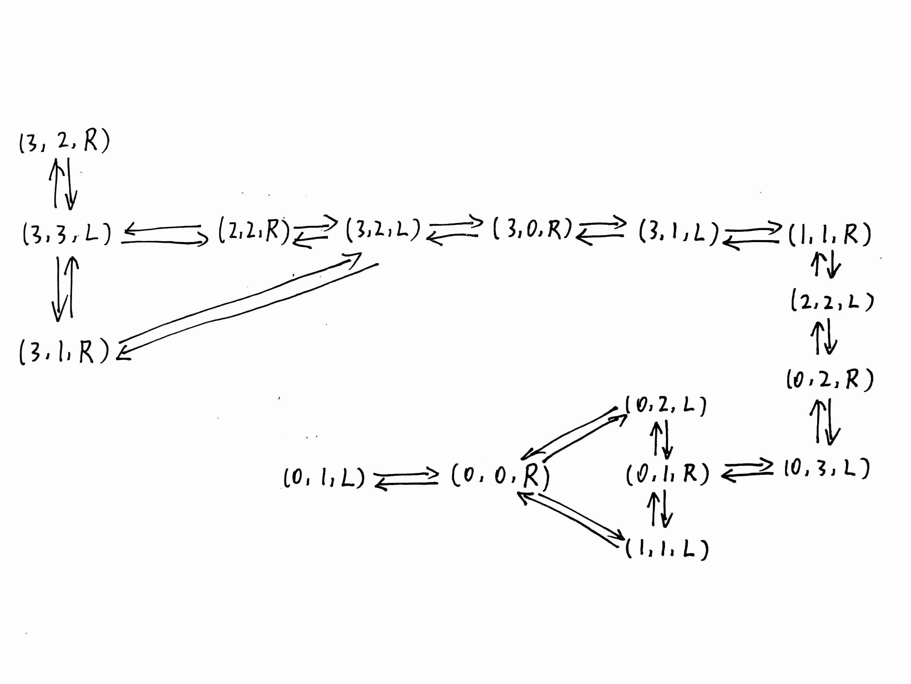

<!--
 * @Author: shysgsg 1054733568@qq.com
 * @Date: 2024-12-08 16:31:23
 * @LastEditors: shysgsg 1054733568@qq.com
 * @LastEditTime: 2024-12-08 21:43:27
 * @FilePath: \人工智能\homework3.md
 * @Description: 这是默认设置,请设置`customMade`, 打开koroFileHeader查看配置 进行设置: https://github.com/OBKoro1/koro1FileHeader/wiki/%E9%85%8D%E7%BD%AE
-->
# homework3
## 孙皓宇 202418019427074

### 1. 机器人走迷宫

#### （1）将问题形式化。状态空间有多大？
- 形式化：我们可以将迷宫看作一个二维网格，其中每个格子可以是通路或障碍。机器人的状态可以用其当前位置和朝向（北、东、南、西）来表示。因此，状态空间可以表示为 (x, y, direction) 的集合，其中 (x, y) 是机器人在迷宫中的位置，direction 是机器人的朝向。
- 状态空间大小：假设迷宫是一个 M x N 的网格，那么位置 (x, y) 的可能取值范围是 0 ≤ x < M 和 0 ≤ y  

### 2. 传教士和野人问题

#### （1）详细形式化与状态空间图
- 问题形式化：
    我们有三个传教士（M）和三个野人（C）在河的一岸，需要利用一条船将他们全部渡到河的另一岸。船能载一个人或者两个人，且在任何时候，在任何一边的岸上或船上，野人数都不能多于传教士数。

- 状态表示：
    我们可以使用三元组 (M_left, C_left, boat_position) 来表示状态，其中：
    - `M_left` 表示左岸的传教士数
    - `C_left` 表示左岸的野人数
    - `boat_position` 表示船的位置（'L' 表示左岸，'R' 表示右岸）

- 状态空间图：
    

#### （2）搜索算法与过程
- 搜索算法：
    对于此类问题，可以使用广度优先搜索（BFS）或深度优先搜索（DFS）来求解。由于我们需要找到最优解（即最短路径），因此BFS是更合适的选择。
- 搜索过程：
    - 初始化队列，将初始状态加入队列。
    - 初始化一个集合来记录已访问的状态，以避免重复搜索。
    - 当队列不为空时，执行以下步骤：
    - 从队列中取出一个状态。
    - 检查该状态是否为终止状态。如果是，则搜索结束，返回路径。
    - 否则，生成该状态的所有可能下一个状态。
    - 对于每个生成的下一个状态，如果它满足约束条件且未被访问过，则将其加入队列，并标记为已访问。
    - 如果队列为空且未找到终止状态，则问题无解。

检查重复状态：
    对于这个问题，检查重复状态是一个好主意。由于状态空间庞大且存在对称性，如果不检查重复状态，搜索过程可能会陷入无限循环或重复搜索相同的路径。通过检查重复状态，我们可以显著提高搜索效率。

#### （3）求解困难的原因
尽管这个问题的状态空间在理论上看起来相对简单（只是一个三元组），但实际上求解它很困难的原因有几个：
- 状态空间庞大：即使考虑到对称性和约束条件，可能的状态数量仍然非常大。这导致搜索过程需要很长时间才能完成。
- 约束条件复杂：约束条件（即任何一边的野人数都不能多于传教士数）使得在生成下一个状态时需要进行额外的检查。这增加了搜索过程的复杂性。
- 搜索路径的多样性：由于有多种可能的移动方式（船可以载一个人或两个人，且可以在任何一边的岸上或船上），因此存在多种可能的搜索路径。这使得找到最优解变得更加困难。

