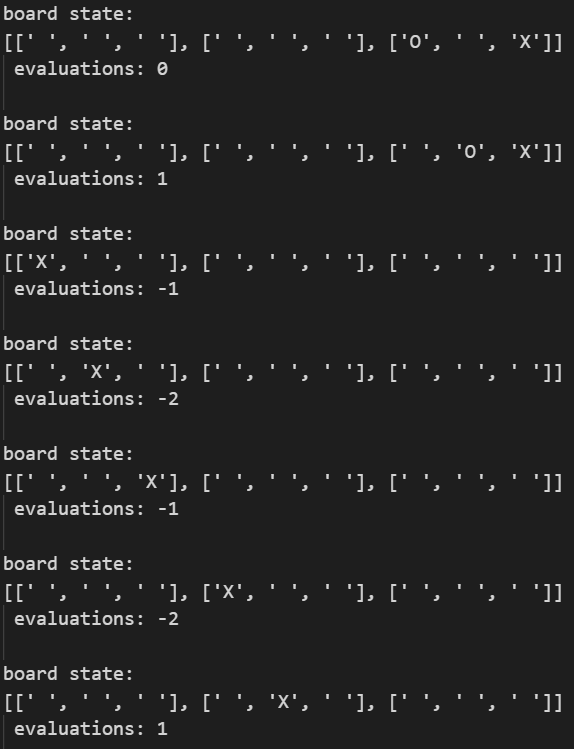
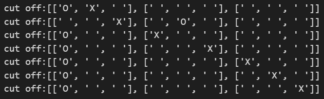
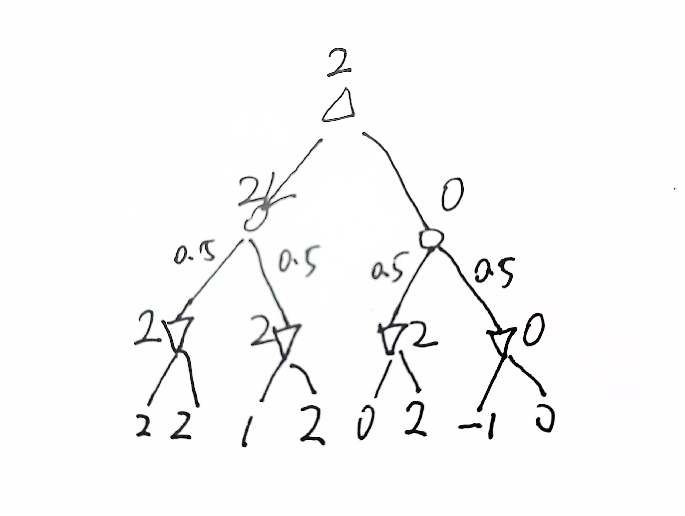
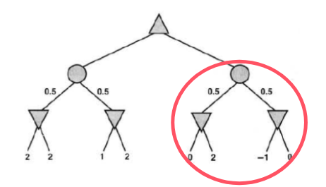

<!--
 * @Author: shysgsg 1054733568@qq.com
 * @Date: 2024-12-08 21:55:27
 * @LastEditors: shysgsg 1054733568@qq.com
 * @LastEditTime: 2024-12-09 00:16:13
 * @FilePath: \人工智能\homework5\homework5.md
 * @Description: 这是默认设置,请设置`customMade`, 打开koroFileHeader查看配置 进行设置: https://github.com/OBKoro1/koro1FileHeader/wiki/%E9%85%8D%E7%BD%AE
-->
# homework5
## 孙皓宇 202418019427074

### 井字棋问题

#### a. 估算可能的井字棋局数
- 井字棋是一个3x3的棋盘，每个格子可以是空的、X或O。因此，每个格子有3种可能的状态。总共有9个格子，所以可能的棋局数为 \(3^9 = 19683\)。但是，这包括了所有可能的排列，包括那些在实际游戏中不可能出现的（比如所有格子都是X或O的情况）。实际的棋局数会少于这个数，但这个数可以作为一个上限的估算。一个合法状态遵循以下规则：
    - X 和 O 交替下棋，且 X 先行。
    - 每个格子只能填写一次。
    - 游戏结束后，不能再进行下一步。

&emsp;&emsp;基于上述规则，我们可以使用递归的方法生成所有合法的棋盘状态，以下是代码：
```py
# 检查当前棋盘是否是一个合法的状态
def is_legal(board):
    # 统计 X 和 O 的数量
    x_count = board.count('X')
    o_count = board.count('O')

    # X 的数量必须大于等于 O 的数量，且 X 的数量最多只能比 O 多 1
    if not (x_count == o_count or x_count == o_count + 1):
        return False

    # 检查是否有任何一方已经胜利，如果有，另一个玩家不能下棋
    if check_winner(board, 'X') and x_count == o_count:
        return False  # 如果 X 胜利，X 的数量必须比 O 多 1
    if check_winner(board, 'O') and x_count > o_count:
        return False  # 如果 O 胜利，O 的数量必须等于 X

    return True

# 检查某一方是否胜利
def check_winner(board, player):
    # 定义所有可能的胜利组合
    winning_positions = [
        [0, 1, 2], [3, 4, 5], [6, 7, 8],  # 行
        [0, 3, 6], [1, 4, 7], [2, 5, 8],  # 列
        [0, 4, 8], [2, 4, 6]               # 对角线
    ]
    for positions in winning_positions:
        if all(board[i] == player for i in positions):
            return True
    return False

# 遍历所有合法的井字棋状态
def generate_all_legal_boards(board, player, legal_boards_set):
    # 如果当前棋盘是合法的且没有更多的棋可以下，添加到合法状态列表
    if is_legal(board):
        legal_boards_set.add(board)  # 使用集合避免重复的棋盘
    
    # 递归生成所有可能的下一步棋局
    for i in range(9):
        if board[i] == ' ':
            new_board = list(board)  # 将当前字符串转换为列表
            new_board[i] = player  # 当前玩家下棋
            new_player = 'O' if player == 'X' else 'X'  # 切换玩家
            generate_all_legal_boards(''.join(new_board), new_player, legal_boards_set)

# 主程序
def main():
    # 初始化棋盘为空格
    board = ' ' * 9  # 3x3 的棋盘，用字符串表示，空格表示未下棋
    legal_boards_set = set()  # 使用集合来存储合法状态，避免重复

    # 生成所有合法状态
    generate_all_legal_boards(board, 'X', legal_boards_set)

    # 输出合法状态的数量
    # print(f"共有 {len(legal_boards_set)} 个合法状态：")
    print(len(legal_boards_set))
    

if __name__ == "__main__":
    main()
```
</br>

结果为：
```py
5478
```
</br>


#### b. 给出从空棋盘开始的深度为2的完整博弈树
- 从空棋盘开始，X先手，有9种可能的走法。对于X的每一种走法，O有8种可能的回应。因此，深度为2的博弈树有 \(9 \times 8 = 72\) 个叶子节点。它的结构为：
  1. X在某个位置下棋，有9种选择。
  2. 对于X的每一种选择，O在剩下的8个位置中选择一个下棋，有8种选择。

全部用手画太多了，我们使用代码生成：
```py
# 生成深度为2的博弈树
def generate_game_tree(board, player, depth):
    if depth == 0:
        return  # 到达最大深度，停止递归

    # 遍历棋盘上的所有空位，当前玩家下棋
    next_player = 'O' if player == 'X' else 'X'  # 切换玩家
    for i in range(9):
        if board[i] == ' ':
            new_board = list(board)
            new_board[i] = player  # 当前玩家下棋
            new_board_str = ''.join(new_board)
            
            # 打印当前棋盘状态
            print_board(new_board_str)
            
            # 递归生成下一个深度的博弈树
            generate_game_tree(new_board_str, next_player, depth - 1)

def main():
    # 初始化空棋盘
    board = ' ' * 9  # 空棋盘：9个空格
    
    # 生成深度为2的博弈树
    generate_game_tree(board, 'X', 2)

if __name__ == "__main__":
    main()
```
</br>

#### c. 标出深度为2的棋局的评估函数值
- 定义 \(X_n\) 为恰好有 \(n\) 个 X 而没有 0 的行、列或者对角线的数目。同样 \(O_n\) 为正好有 \(n\) 个 O 的行、列或者对角线的数目。效用函数给 \(X_3=1\) 的棋局 +1，给 \(O_3=1\) 的棋局 -1。所有其他终止状态效用值为 0。对于非终止状态，使用线性的评估函数定义为 \(Eval(s) = 3X_2(s) + X_1(s) - (3O_2(s) + O_1(s))\)。
```py
def count_x_o_line(line):
    X_count = line.count('X')
    O_count = line.count('O')
    return X_count, O_count

def eval_terminal_state(board):
    if check_win(board, 'X'):
        return 1  # X wins
    if check_win(board, 'O'):
        return -1  # O wins
    return 0  # No winner yet

def evaluate(board):
    terminal_eval = eval_terminal_state(board)
    if terminal_eval != 0:
        return terminal_eval
    
    X_1 = X_2 = O_1 = O_2 = 0
    lines = []
    # 横向行
    for i in range(3):
        lines.append(board[i])
    # 纵向列
    for i in range(3):
        lines.append([board[j][i] for j in range(3)])
    # 对角线
    lines.append([board[i][i] for i in range(3)])
    lines.append([board[i][2-i] for i in range(3)])

    for line in lines:
        X_count, O_count = count_x_o_line(line)
        if X_count == 3:
            X_2 += 1
        elif X_count == 2:
            X_2 += 1
        elif X_count == 1:
            X_1 += 1
        if O_count == 3:
            O_2 += 1
        elif O_count == 2:
            O_2 += 1
        elif O_count == 1:
            O_1 += 1
    eval_value = 3 * X_2 + X_1 - (3 * O_2 + O_1)
    return eval_value

def generate_game_tree(board, player, depth):
    if depth == 0:
        return evaluate(board)  # 基础评估（不再继续生成树）
    
    next_player = 'O' if player == 'X' else 'X'
    evaluations = []
    
    # 遍历每个空位置，生成新的状态
    for i in range(3):
        for j in range(3):
            if board[i][j] == ' ':
                new_board = [row[:] for row in board]  # 深拷贝
                new_board[i][j] = player
                print_board(new_board)
                evaluation = generate_game_tree(new_board, next_player, depth - 1)
                evaluations.append((new_board, evaluation))  # 存储评估值
    
    for board_state, eval_value in evaluations:
        print(f"board state: \n{board_state}\n evaluations: {eval_value}\n")
    
    # 选择最优评估值
    if player == 'X':
        return max(evaluations, key=lambda x: x[1])[1]
    else:
        return min(evaluations, key=lambda x: x[1])[1]
    
# 主程序
def main():
    # 初始化棋盘为空格
    board = [
        [' ', ' ', ' '],
        [' ', ' ', ' '],
        [' ', ' ', ' ']
    ]  # 3x3 的棋盘，用字符串表示，空格表示未下棋
    generate_game_tree(board, 'X', 2)

if __name__ == "__main__":
    main()
```
</br>

以下是一些深度为2的棋局的评估函数值：

</br>

#### d. 使用极小极大算法标出深度为1和0的棋局的倒推值，并根据这些值选出最佳的起始行棋
- 极小极大算法的基本思想是，X希望最大化评估函数值，而O希望最小化评估函数值。在深度为2的棋局中，我们已经计算了评估函数值。在深度为1的棋局中，X会为每个可能的走法选择O的回应中评估函数值最大的那个。在深度为0的棋局中（即空棋盘），X会为每个可能的走法选择评估函数值最大的那个。
```py
import copy

# 评估函数
def Eval(board):
    # X_n, O_n 的计数器
    X_1 = X_2 = X_3 = 0
    O_1 = O_2 = O_3 = 0
    
    # 检查行、列和对角线
    for i in range(3):
        # 检查行
        row = [board[i*3 + j] for j in range(3)]
        X_1 += row.count('X') == 1
        X_2 += row.count('X') == 2
        X_3 += row.count('X') == 3
        O_1 += row.count('O') == 1
        O_2 += row.count('O') == 2
        O_3 += row.count('O') == 3
        
        # 检查列
        col = [board[j*3 + i] for j in range(3)]
        X_1 += col.count('X') == 1
        X_2 += col.count('X') == 2
        X_3 += col.count('X') == 3
        O_1 += col.count('O') == 1
        O_2 += col.count('O') == 2
        O_3 += col.count('O') == 3
    
    # 检查对角线
    diag1 = [board[i*3 + i] for i in range(3)]
    diag2 = [board[i*3 + (2-i)] for i in range(3)]
    
    X_1 += diag1.count('X') == 1
    X_2 += diag1.count('X') == 2
    X_3 += diag1.count('X') == 3
    O_1 += diag1.count('O') == 1
    O_2 += diag1.count('O') == 2
    O_3 += diag1.count('O') == 3
    
    X_1 += diag2.count('X') == 1
    X_2 += diag2.count('X') == 2
    X_3 += diag2.count('X') == 3
    O_1 += diag2.count('O') == 1
    O_2 += diag2.count('O') == 2
    O_3 += diag2.count('O') == 3
    
    # 计算评估值
    return 3 * X_2 + X_1 - (3 * O_2 + O_1)

# 检查游戏是否结束
def is_terminal(board):
    return board.count('X') + board.count('O') == 9 or Eval(board) != 0

# 获取所有可能的下一步棋
def get_possible_moves(board):
    return [i for i in range(9) if board[i] == ' ']

# 极小极大算法
def minimax(board, depth, is_maximizing):
    if depth == 0 or is_terminal(board):
        return Eval(board)
    
    possible_moves = get_possible_moves(board)
    
    if is_maximizing:
        max_eval = float('-inf')
        for move in possible_moves:
            new_board = board[:]
            new_board[move] = 'X'
            eval_value = minimax(new_board, depth - 1, False)
            max_eval = max(max_eval, eval_value)
        return max_eval
    else:
        min_eval = float('inf')
        for move in possible_moves:
            new_board = board[:]
            new_board[move] = 'O'
            eval_value = minimax(new_board, depth - 1, True)
            min_eval = min(min_eval, eval_value)
        return min_eval

# 选择最佳起始行棋
def best_move(board):
    possible_moves = get_possible_moves(board)
    best_value = float('-inf')
    best_move = None
    
    for move in possible_moves:
        new_board = board[:]
        new_board[move] = 'X'  # 假设玩家是 X
        move_value = minimax(new_board, 1, False)  # 计算深度为1时的评估值
        if move_value > best_value:
            best_value = move_value
            best_move = move
    
    return best_move

# 初始化棋盘
initial_board = [' ']*9  # 空棋盘

# 获取最佳起始行棋
best_move_result = best_move(initial_board)
print(best_move_result)
```
</br>

结果为`4`，即最佳起始行棋是棋盘最中间。
</br>

#### e. 假设结点按对 \(\alpha-\beta\) 剪枝的最优顺序生成，圈出使用 \(\alpha-\beta\) 剪枝将被剪掉的深度为2的结点
- \(\alpha-\beta\) 剪枝是一种优化极小极大算法的技术，它通过剪掉那些不可能影响最终决策的结点来减少计算量。在最优顺序下，\(\alpha-\beta\) 剪枝会剪掉那些在当前最佳选择下不会被选择的结点。具体来说，如果X在深度为1的某个结点下的所有可能的O的回应中，有一个回应的评估函数值已经小于当前最佳选择的评估函数值，那么其他回应的结点就可以被剪掉。同样，如果O在深度为2的某个结点下的所有可能的X的回应中，有一个回应的评估函数值已经大于当前最佳选择的评估函数值，那么其他回应的结点就可以被剪掉。
```py
# 假设我们已经有了评估函数
def eval_board(board):
    X2 = O2 = X1 = O1 = 0
    # 行列和对角线上的X和O的数量
    for i in range(3):
        row = board[i]
        col = [board[j][i] for j in range(3)]
        
        # 检查行
        if row.count('X') == 2 and row.count('O') == 0: X2 += 1
        if row.count('O') == 2 and row.count('X') == 0: O2 += 1
        if row.count('X') == 1 and row.count('O') == 0: X1 += 1
        if row.count('O') == 1 and row.count('X') == 0: O1 += 1
        
        # 检查列
        if col.count('X') == 2 and col.count('O') == 0: X2 += 1
        if col.count('O') == 2 and col.count('X') == 0: O2 += 1
        if col.count('X') == 1 and col.count('O') == 0: X1 += 1
        if col.count('O') == 1 and col.count('X') == 0: O1 += 1
    
    # 对角线检查
    diag1 = [board[i][i] for i in range(3)]
    diag2 = [board[i][2-i] for i in range(3)]
    for diag in [diag1, diag2]:
        if diag.count('X') == 2 and diag.count('O') == 0: X2 += 1
        if diag.count('O') == 2 and diag.count('X') == 0: O2 += 1
        if diag.count('X') == 1 and diag.count('O') == 0: X1 += 1
        if diag.count('O') == 1 and diag.count('X') == 0: O1 += 1
    
    return 3*X2 + X1 - (3*O2 + O1)

# 初始化游戏树的节点
class Node:
    def __init__(self, board, is_maximizing_player, depth):
        self.board = board  # 当前棋盘状态
        self.is_maximizing_player = is_maximizing_player  # 是否是最大化玩家
        self.depth = depth  # 当前节点的深度
        self.children = []  # 子节点
        self.value = None  # 节点的值（评估值）
        self.alpha = -float('inf')  # 最大值
        self.beta = float('inf')  # 最小值

# 生成子节点（简单的棋盘状态生成，假设不考虑有效性检查）
def generate_children(node):
    if node.depth >= 2:  # 限制深度
        return []
    
    # 假设所有空白位置都可以填X或O
    board = node.board
    children = []
    
    for i in range(3):
        for j in range(3):
            if board[i][j] == ' ':
                new_board = [row.copy() for row in board]  # 复制棋盘
                new_board[i][j] = 'X' if node.is_maximizing_player else 'O'
                children.append(Node(new_board, not node.is_maximizing_player, node.depth + 1))
    
    return children

# Alpha-beta 剪枝算法
def alpha_beta(node, alpha, beta):
    if node.depth == 2:  # 到达深度 2，返回评估值
        node.value = eval_board(node.board)
        return node.value
    
    if node.is_maximizing_player:
        max_eval = -float('inf')
        for child in generate_children(node):
            eval_value = alpha_beta(child, alpha, beta)
            max_eval = max(max_eval, eval_value)
            alpha = max(alpha, eval_value)
            if beta <= alpha:  # 剪枝
                print(f"cut off:{child.board}")
                break
        node.value = max_eval
        return max_eval
    else:
        min_eval = float('inf')
        for child in generate_children(node):
            eval_value = alpha_beta(child, alpha, beta)
            min_eval = min(min_eval, eval_value)
            beta = min(beta, eval_value)
            if beta <= alpha:  # 剪枝
                print(f"cut off:{child.board}")
                break
        node.value = min_eval
        return min_eval

# 初始化一个棋盘状态
initial_board = [[' ', ' ', ' '], [' ', ' ', ' '], [' ', ' ', ' ']]
root = Node(initial_board, True, 0)  # 假设X是最大化玩家

# 执行alpha-beta剪枝
alpha_beta(root, -float('inf'), float('inf'))
```
</br>

最终结果如下：

</br>


### 博弈树问题

#### a. 


#### b. 
- 如果给定前六个叶节点的值，例如前六个叶节点的值决定了前三个内部节点的值分别是`a`, `b`, `c`，而这两个内部节点的值又决定了上层节点的值为`d = min{a, b}`, `e∈(-∞, c]`，则根节点的值为`max{d, e}`，如果`c < d`，则根节点的值为`d`，不受第七第八节点影响，否则根节点值受第七第八节点影响。

- 如果给定前七个叶节点的值，前七个叶节点的值已经决定了前四个内部节点的值分别是`a`, `b`, `c`, `e∈[d, +∞]`，上层节点的值为`f = min{a, b}`, `g = min{c, e}`，则根结点的值为`max{f, g}`，如果`c < d`，则根结点的值为`max{f, c}`，不受第八节点影响，如果`f > d`，则根结点的值为`max{f, c}`，不受第八节点影响，否则根节点值受第八节点影响。

#### c. 
假设叶节点的值都在`-2`到`2`之间。计算完前两个叶节点值之后，左手机会结点的取值范围是这两个叶节点值的最小值和最大值之间的范围。如果前两个叶节点的值分别是`-2`和`2`，那么左手机会结点的取值范围是`[-2, 2]`。

#### d.
在c中假设下，如果左手玩家已经知道前两个叶节点的值（都是2），并且叶节点的值是从左到右计算的，叶节点的值都在-2到2之间，所以在计算完第四个叶节点时，就已经能够确定左手机会结点的值为2了，不需要计算其他叶节点的值了。
<center>


</center>