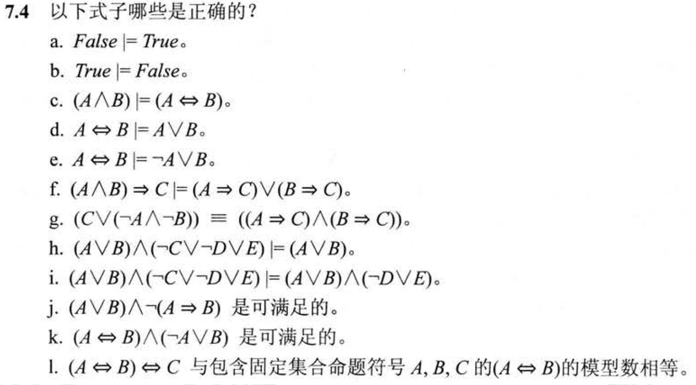

<!--
 * @Author: shysgsg 1054733568@qq.com
 * @Date: 2024-12-14 22:37:40
 * @LastEditors: shysgsg 1054733568@qq.com
 * @LastEditTime: 2024-12-14 22:57:08
 * @FilePath: \人工智能\homework7\homework7.md
 * @Description: 这是默认设置,请设置`customMade`, 打开koroFileHeader查看配置 进行设置: https://github.com/OBKoro1/koro1FileHeader/wiki/%E9%85%8D%E7%BD%AE
-->
# homework7

## 问题一

### 逻辑符号回顾
首先明确一下涉及到的主要逻辑符号含义：
- `|=` 表示逻辑后承（logical consequence），意思是在所有使左边式子为真的解释下，右边式子也一定为真。
- `∧` 表示逻辑与（and），只有当参与运算的两个命题都为真时，结果才为真。
- `∨` 表示逻辑或（or），只要参与运算的两个命题中有一个为真，结果就为真。
- `→` 表示逻辑蕴涵（implication），当前提为真时，若结论为假则整个蕴涵式为假，其余情况（前提为假或者前提和结论都为真）蕴涵式为真。
- `⇔` 表示逻辑等价（equivalence），要求两边命题的真值始终相同。
- `¬` 表示逻辑非（negation），对命题的真值取反。

### 各选项分析
- **a. `False |= True`**：
    - **分析**：根据逻辑后承的定义，虽然 `False` 本身在任何解释下都不可能为真，但按照逻辑中“假前提可以蕴含任何结论”的规则（因为不存在使 `False` 为真的情况去违反右边结论的真值要求），所以从逻辑后承角度可以说 `False |= True` 是成立的。
    - **答案**：正确。
- **b. `True |= False`**：
    - **分析**：`True` 作为前提，如果按照逻辑后承的要求，意味着在 `True` 为真的所有解释下，右边的 `False` 也得为真，但显然 `True` 为真时无法保证 `False` 为真呀，这不符合逻辑后承的定义。
    - **答案**：不正确。
- **c. `(A ∧ B) |= (A ⇔ B)`**：
    - **分析**：当 `(A ∧ B)` 为真时，意味着 `A` 和 `B` 同时为真。而对于 `(A ⇔ B)` 为真要求 `A` 和 `B` 同真同假。仅由 `A` 和 `B` 同时为真这一情况（也就是 `(A ∧ B)` 为真的情况）不能必然推出在所有解释下只要 `A` 和 `B` 取值就一定同真同假（比如可以出现 `A` 真 `B` 假等其他使 `(A ⇔ B)` 为假的赋值情况），所以不满足逻辑后承关系。
    - **答案**：不正确。
- **d. `A ⇔ B |= A ∨ B`**：
    - **分析**：`A ⇔ B` 表示 `A` 和 `B` 有相同的真值，当 `A` 和 `B` 同为假时，`A ⇔ B` 为真，但此时 `A ∨ B` 为假，也就是说存在使左边 `A ⇔ B` 为真但右边 `A ∨ B` 不为真的情况，不符合逻辑后承定义。
    - **答案**：不正确。
- **e. `A ⇔ B |= ¬A ∨ B`**：
    - **分析**：同样，当 `A` 和 `B` 都为假时，`A ⇔ B` 为真，而此时 `¬A ∨ B` 为假，存在这种左边为真右边不为真的赋值情况，不满足逻辑后承要求。
    - **答案**：不正确。
- **f. `(A ∧ B) → C |= (A → C) ∨ (B → C)`**：
    - **分析**：
        - 先看左边式子 `(A ∧ B) → C`，其等价于 `¬(A ∧ B) ∨ C`，也就是 `(¬A ∨ ¬B) ∨ C`。
        - 再看右边式子 `(A → C) ∨ (B → C)`，等价于 `(¬A ∨ C) ∨ (¬B ∨ C)` ，整理后也是 `(¬A ∨ ¬B) ∨ C`。
        - 可以发现左右两边式子是逻辑等价的，那么必然满足逻辑后承关系，因为只要左边为真右边肯定为真（它们真值始终一样）。
    - **答案**：正确。
- **g. `(C ∨ (¬A ∧ ¬B)) ≡ ((A → C) ∧ (B → C))`**：
    - **分析**：
        - 左边式子 `(C ∨ (¬A ∧ ¬B))` 等价于 `C ∨ ¬(A ∨ B)`。
        - 右边式子 `((A → C) ∧ (B → C))` 等价于 `((¬A ∨ C) ∧ (¬B ∨ C))`，进一步可整理为 `(¬A ∧ ¬B) ∨ C`，也就是 `C ∨ (¬A ∧ ¬B)` 。
        - 左右两边式子逻辑等价，所以满足逻辑后承关系，因为在所有使左边式子为真的解释下，右边式子必然也为真（二者真值相同）。
    - **答案**：正确。
- **h. `(A ∨ B) ∧ (¬C ∨ ¬D ∨ E) |= (A ∨ B)`**：
    - **分析**：对于逻辑后承关系，如果左边式子 `(A ∨ B) ∧ (¬C ∨ ¬D ∨ E)` 为真，由于逻辑与的性质，就要求 `(A ∨ B)` 和 `(¬C ∨ ¬D ∨ E)` 都为真，那必然意味着 `(A ∨ B)` 为真呀，所以满足逻辑后承定义。
    - **答案**：正确。
- **i. `(A ∨ B) ∧ (¬C ∨ ¬D ∨ E) |= (A ∨ B) ∧ (¬D ∨ E)`**：
    - **分析**：当左边式子 `(A ∨ B) ∧ (¬C ∨ ¬D ∨ E)` 为真时，只能保证 `(A ∨ B)` 和 `(¬C ∨ ¬D ∨ E)` 为真，但不能必然保证 `(A ∨ B) ∧ (¬D ∨ E)` 一定为真，比如存在 `C` 为假，`D` 为真等情况使得左边为真但右边的 `(¬D ∨ E)` 部分不一定满足，不满足逻辑后承要求。
    - **答案**：不正确。
- **j. `(A ∨ B) ∧ ¬(A → B)` 是可满足的**：
    - **分析**：式子 `(A ∨ B) ∧ ¬(A → B)` 中，`¬(A → B)` 等价于 `A ∧ ¬B`，那么原式子就相当于 `(A ∨ B) ∧ (A ∧ ¬B)`，当 `A` 为真且 `B` 为假时，这个式子为真，所以它是可满足的，存在使其成立的赋值情况。
    - **答案**：正确。
- **k. `(A ⇔ B) ∧ ¬(A ∨ B)` 是可满足的**：
    - **分析**：式子 `(A ⇔ B) ∧ ¬(A ∨ B)` 中，`¬(A ∨ B)` 等价于 `¬A ∧ ¬B`，原式子就变为 `(A ⇔ B) ∧ (¬A ∧ ¬B)`，当 `A` 和 `B` 都为假时，该式子为真，所以存在使其满足的赋值情况，是可满足的。
    - **答案**：正确。
- **l. `(A ⇔ B) ⇔ C` 与包含固定集合命题符号 `A`、`B`、`C` 的 `(A ⇔ B)` 的模型数相等**：
    - **分析**：
        - 对于 `(A ⇔ B)` ，其有 4 种不同的真值组合情况（`A` 真 `B` 真、`A` 真 `B` 假、`A` 假 `B` 真、`A` 假 `B` 假）。
        - 而对于 `(A ⇔ B) ⇔ C` ，它一共有 8 种不同的真值组合情况，因为涉及到三个命题的取值组合了。
        - 显然二者的模型数（也就是使其为真的不同赋值情况数量）是不相等的。
    - **答案**：不正确。

**总结**：正确的选项是 a、f、g、h、j、k。 
