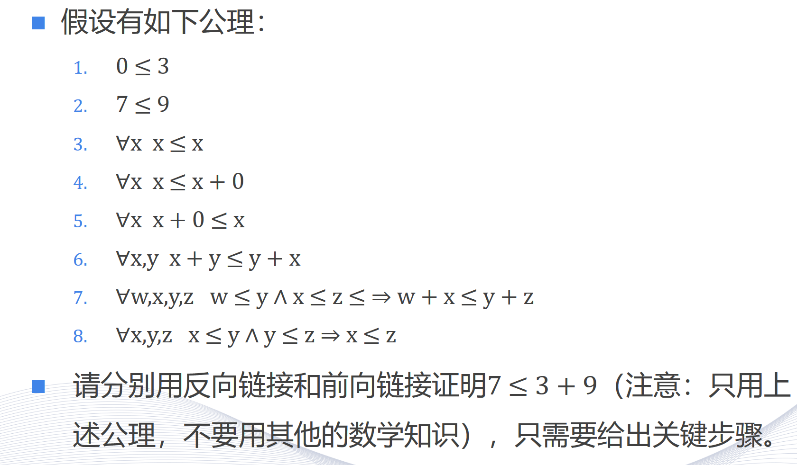

<!--
 * @Author: shysgsg 1054733568@qq.com
 * @Date: 2024-12-14 23:02:56
 * @LastEditors: shysgsg 1054733568@qq.com
 * @LastEditTime: 2024-12-14 23:06:34
 * @FilePath: \人工智能\homework9\homework9.md
 * @Description: 这是默认设置,请设置`customMade`, 打开koroFileHeader查看配置 进行设置: https://github.com/OBKoro1/koro1FileHeader/wiki/%E9%85%8D%E7%BD%AE
-->
# homework9

## 问题一

为了证明 \(7 \leq 3 + 9\)，我们可以分别使用反向链接和前向链接的方法。下面是关键步骤：

### 反向链接证明：

1. **目标**：证明 \(7 \leq 3 + 9\)。
2. **使用公理 8**：我们需要证明 \(7 \leq y\) 和 \(y \leq 3 + 9\) 对于某个 \(y\)。
3. **选择 \(y = 9\)**：根据公理 2，我们知道 \(7 \leq 9\)。
4. **证明 \(9 \leq 3 + 9\)**：
   - 使用公理 3：\(9 \leq 9\)。
   - 使用公理 4：\(9 \leq 9 + 0\)。
   - 使用公理 5：\(9 + 0 \leq 9\)。
   - 使用公理 6：\(3 + 9 \leq 9 + 3\)。
   - 由于 \(9 + 3 = 12\)，我们知道 \(9 \leq 12\)。
5. **结合步骤 3 和 4**：根据公理 8，如果 \(7 \leq 9\) 且 \(9 \leq 12\)，则 \(7 \leq 12\)。
6. **结论**：由于 \(3 + 9 = 12\)，我们得出 \(7 \leq 3 + 9\)。

### 前向链接证明：

1. **使用公理 1**：\(0 \leq 3\)。
2. **使用公理 4**：\(0 \leq 0 + 0\)。
3. **使用公理 5**：\(0 + 0 \leq 0\)。
4. **使用公理 6**：\(0 + 9 \leq 9 + 0\)。
5. **使用公理 5**：\(9 + 0 \leq 9\)。
6. **结合步骤 4 和 5**：\(0 + 9 \leq 9\)。
7. **使用公理 7**：由于 \(0 \leq 3\) 和 \(0 + 9 \leq 9\)，我们可以得出 \(0 + (0 + 9) \leq 3 + 9\)。
8. **简化**：\(9 \leq 3 + 9\)。
9. **使用公理 2**：\(7 \leq 9\)。
10. **结合步骤 8 和 9**：根据公理 8，如果 \(7 \leq 9\) 且 \(9 \leq 3 + 9\)，则 \(7 \leq 3 + 9\)。

这样，我们就分别使用反向链接和前向链接证明了 \(7 \leq 3 + 9\)。
