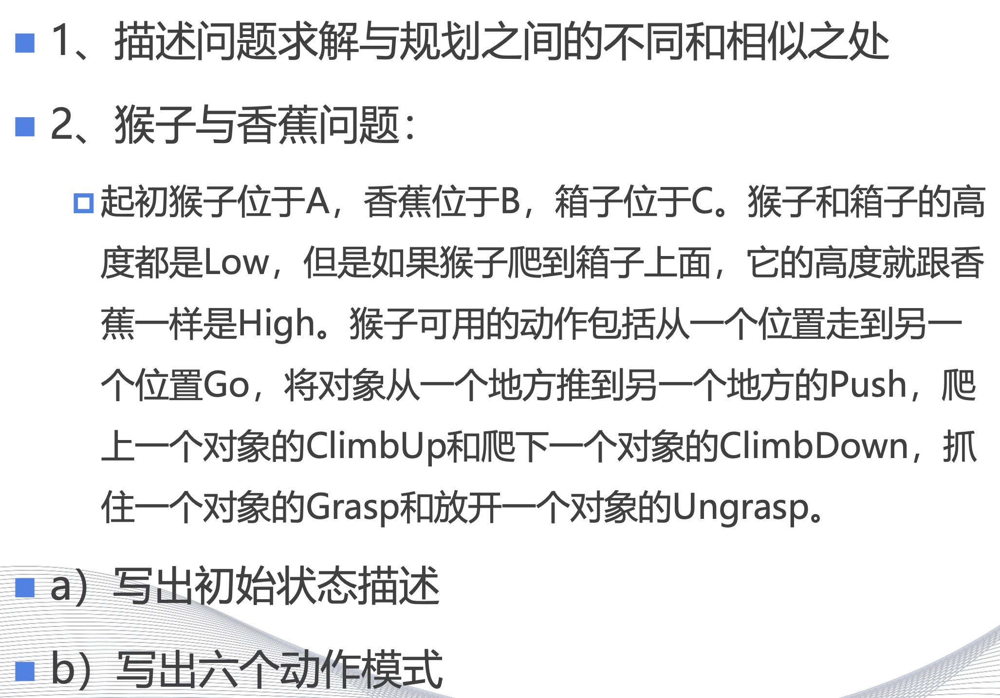

<!--
 * @Author: shysgsg 1054733568@qq.com
 * @Date: 2024-12-14 23:17:08
 * @LastEditors: shysgsg 1054733568@qq.com
 * @LastEditTime: 2024-12-14 23:20:10
 * @FilePath: \人工智能\homework11\homework11.md
 * @Description: 这是默认设置,请设置`customMade`, 打开koroFileHeader查看配置 进行设置: https://github.com/OBKoro1/koro1FileHeader/wiki/%E9%85%8D%E7%BD%AE
-->
# homework11

 

## 1. 问题求解与规划之间的不同和相似之处

**相似之处：**
- 两者都涉及到寻找解决方案的过程。
- 都需要对问题的状态空间进行探索。
- 都可以使用搜索算法来找到解决方案。

**不同之处：**
- **问题求解**通常指的是找到问题的一个解决方案的过程，它可能不涉及对未来状态的预测或规划。
- **规划**则涉及到对未来行动的预测和安排，它需要考虑一系列动作及其后果，以达成一个或多个目标。
- 问题求解可能只需要解决当前的问题，而规划则需要考虑长远的目标和可能的变数。
- 规划通常需要更多的信息，如时间、资源限制等，来构建一个可行的行动方案。
 

## 2. 猴子与香蕉问题

### a) 初始状态描述
- 猴子（Monkey）位于位置A，高度为Low。
- 香蕉（Banana）位于位置B，高度为High。
- 箱子（Box）位于位置C，高度为Low。
- 猴子没有抓住任何物体，即未进行Grasp动作。

### b) 六个动作模式
1. **Go(A, C)**: 猴子从位置A走到位置C。
2. **ClimbUp(C)**: 猴子爬上箱子C，高度变为High。
3. **Go(C, B)**: 猴子从箱子C的位置走到香蕉B的位置。
4. **Grasp(B)**: 猴子抓住香蕉B。
5. **ClimbDown(C)**: 猴子从箱子C上爬下来，高度变为Low。
6. **Go(C, A)**: 猴子从箱子C的位置走回初始位置A。

这些动作模式构成了一个可能的解决方案，使得猴子能够获取到香蕉。

