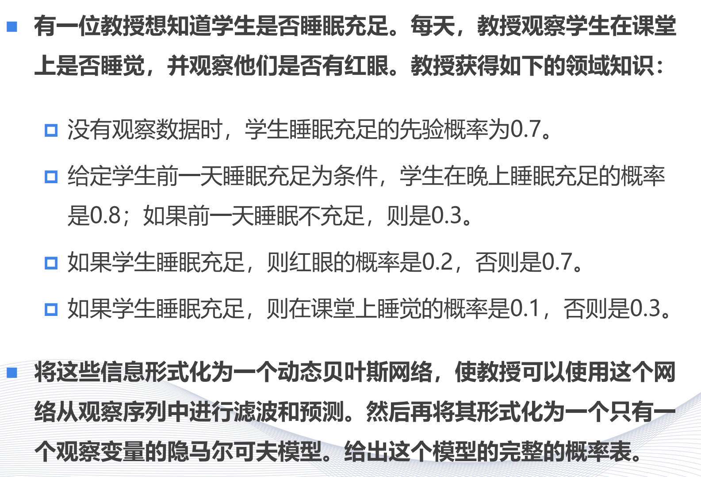
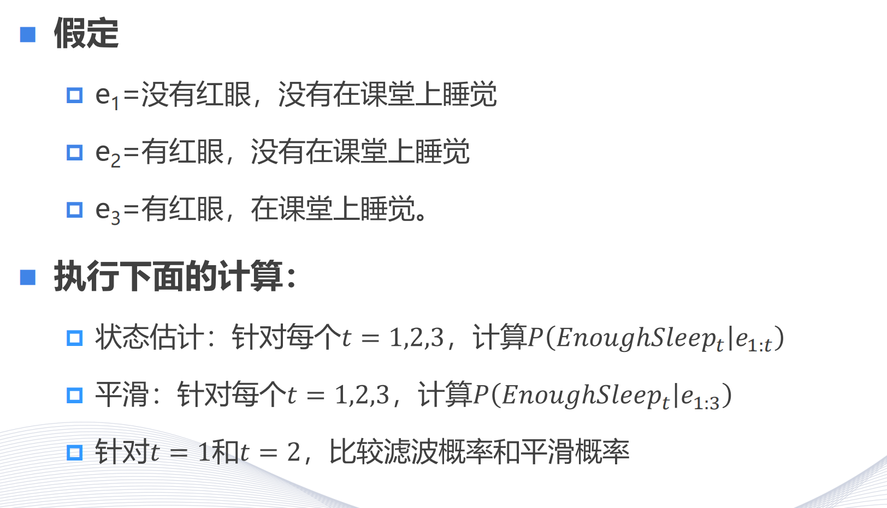

# homework12

## 问题一

1. 首先，我们定义变量：
   - 令\(S\)表示学生睡眠充足事件，\(\neg S\)表示学生睡眠不充足事件。
   - 令\(R\)表示学生有红眼事件，\(\neg R\)表示学生没有红眼事件。
   - 令\(C\)表示学生在课堂上睡觉事件，\(\neg C\)表示学生在课堂上不睡觉事件。

2. 根据题目中的条件概率：
   - \(P(S) = 0.7\)（没有观察数据时，学生睡眠充足的先验概率）
   - \(P(S|\text{前一天睡眠充足}) = 0.8\)，\(P(S|\text{前一天睡眠不充足}) = 0.3\)
   - \(P(R|S) = 0.2\)，\(P(R|\neg S) = 0.7\)
   - \(P(C|S) = 0.1\)，\(P(C|\neg S) = 0.3\)

3. 我们要构建一个动态贝叶斯网络（DBN），并将其转化为隐马尔可夫模型（HMM）。

   - 动态贝叶斯网络（DBN）是一种概率图模型，用于表示随时间变化的随机过程。在这个问题中，我们可以将每天学生的睡眠情况、红眼情况和课堂睡觉情况看作是一个时间序列。

   - 隐马尔可夫模型（HMM）由两个部分组成：隐藏状态（在这个问题中是学生的睡眠情况\(S\)）和观察变量（在这个问题中是红眼情况\(R\)和课堂睡觉情况\(C\)）。

4. 构建HMM的概率表：
   - 初始状态概率：
     - \(P(S) = 0.7\)
     - \(P(\neg S) = 1 - 0.7 = 0.3\)
   - 状态转移概率：
     - \(P(S_{t + 1}|S_t) = 0.8\)（如果前一天睡眠充足，当天睡眠充足的概率）
     - \(P(S_{t + 1}|\neg S_t) = 0.3\)（如果前一天睡眠不充足，当天睡眠充足的概率）
     - \(P(\neg S_{t + 1}|S_t) = 1 - 0.8 = 0.2\)
     - \(P(\neg S_{t + 1}|\neg S_t) = 1 - 0.3 = 0.7\)
   - 观察概率：
     - \(P(R|S) = 0.2\)，\(P(R|\neg S) = 0.7\)
     - \(P(C|S) = 0.1\)，\(P(C|\neg S) = 0.3\)

5. 完整的概率表如下：

   - 初始状态概率：
     | 状态 | 概率 |
     | ---- | ---- |
     | \(S\) | 0.7  |
     | \(\neg S\) | 0.3  |

   - 状态转移概率：
     | 从/到 | \(S\) | \(\neg S\) |
     | ---- | ---- | ---- |
     | \(S\) | 0.8  | 0.2  |
     | \(\neg S\) | 0.3  | 0.7  |

   - 观察概率：
     | 状态 | \(R\) | \(\neg R\) | \(C\) | \(\neg C\) |
     | ---- | ---- | ---- | ---- | ---- |
     | \(S\) | 0.2  | 0.8  | 0.1  | 0.9  |
     | \(\neg S\) | 0.7  | 0.3  | 0.3  | 0.7  |

通过这些概率表，教授可以使用隐马尔可夫模型对学生的睡眠情况进行滤波和预测。
 

## 问题二

1. 首先，我们回顾一下之前建立的隐马尔可夫模型（HMM）的概率表：

   - 初始状态概率：
     | 状态 | 概率 |
     | ---- | ---- |
     | \(S\)（睡眠充足） | 0.7  |
     | \(\neg S\)（睡眠不充足） | 0.3  |

   - 状态转移概率：
     | 从/到 | \(S\) | \(\neg S\) |
     | ---- | ---- | ---- |
     | \(S\) | 0.8  | 0.2  |
     | \(\neg S\) | 0.3  | 0.7  |

   - 观察概率：
     | 状态 | \(R\)（有红眼） | \(\neg R\)（无红眼） | \(C\)（课堂睡觉） | \(\neg C\)（课堂不睡觉） |
     | ---- | ---- | ---- | ---- | ---- |
     | \(S\) | 0.2  | 0.8  | 0.1  | 0.9  |
     | \(\neg S\) | 0.7  | 0.3  | 0.3  | 0.7  |

2. 我们要根据给定的观察序列计算概率：

   - 观察序列：
     - \(e_1=\)没有红眼，没有在课堂上睡觉
     - \(e_2=\)有红眼，没有在课堂上睡觉
     - \(e_3=\)有红眼，在课堂上睡觉

3. 计算状态估计 \(P(\text{EnoughSleep}_t|e_{1:t})\)：

   - 对于 \(t = 1\)：
     - \(e_1=\)没有红眼，没有在课堂上睡觉
     - \(P(\text{EnoughSleep}_1|e_1) = \frac{P(e_1|\text{EnoughSleep}_1)P(\text{EnoughSleep}_1)}{P(e_1)}\)
     - \(P(e_1|\text{EnoughSleep}_1) = P(\neg R|\text{EnoughSleep}_1)P(\neg C|\text{EnoughSleep}_1) = 0.8\times0.9 = 0.72\)
     - \(P(e_1|\neg \text{EnoughSleep}_1) = P(\neg R|\neg \text{EnoughSleep}_1)P(\neg C|\neg \text{EnoughSleep}_1) = 0.3\times0.7 = 0.21\)
     - \(P(\text{EnoughSleep}_1|e_1) = \frac{0.72\times0.7}{0.72\times0.7 + 0.21\times0.3} = \frac{0.504}{0.504 + 0.063} = \frac{0.504}{0.567} \approx 0.89\)

   - 对于 \(t = 2\)：
     - \(e_2=\)有红眼，没有在课堂上睡觉
     - \(P(\text{EnoughSleep}_2|e_{1:2}) = \frac{P(e_2|\text{EnoughSleep}_2)P(\text{EnoughSleep}_2|e_1)P(\text{EnoughSleep}_1)}{P(e_{1:2})}\)
     - \(P(e_2|\text{EnoughSleep}_2) = P(R|\text{EnoughSleep}_2)P(\neg C|\text{EnoughSleep}_2) = 0.2\times0.9 = 0.18\)
     - \(P(e_2|\neg \text{EnoughSleep}_2) = P(R|\neg \text{EnoughSleep}_2)P(\neg C|\neg \text{EnoughSleep}_2) = 0.7\times0.7 = 0.49\)
     - 先计算 \(P(e_{1:2}|\text{EnoughSleep}_2) = P(e_1|\text{EnoughSleep}_2)P(e_2|\text{EnoughSleep}_2) = 0.72\times0.18 = 0.1296\)
     - \(P(e_{1:2}|\neg \text{EnoughSleep}_2) = P(e_1|\neg \text{EnoughSleep}_2)P(e_2|\neg \text{EnoughSleep}_2) = 0.21\times0.49 = 0.1029\)
     - \(P(\text{EnoughSleep}_2|e_{1:2}) = \frac{0.1296\times0.7}{0.1296\times0.7 + 0.1029\times0.3} = \frac{0.09072}{0.09072 + 0.03087} = \frac{0.09072}{0.12159} \approx 0.75\)

   - 对于 \(t = 3\)：
     - \(e_3=\)有红眼，在课堂上睡觉
     - \(P(\text{EnoughSleep}_3|e_{1:3}) = \frac{P(e_3|\text{EnoughSleep}_3)P(\text{EnoughSleep}_3|e_{1:2})P(\text{EnoughSleep}_2|e_1)P(\text{EnoughSleep}_1)}{P(e_{1:3})}\)
     - \(P(e_3|\text{EnoughSleep}_3) = P(R|\text{EnoughSleep}_3)P(C|\text{EnoughSleep}_3) = 0.2\times0.1 = 0.02\)
     - \(P(e_3|\neg \text{EnoughSleep}_3) = P(R|\neg \text{EnoughSleep}_3)P(C|\neg \text{EnoughSleep}_3) = 0.7\times0.3 = 0.21\)
     - 先计算 \(P(e_{1:3}|\text{EnoughSleep}_3) = P(e_1|\text{EnoughSleep}_3)P(e_2|\text{EnoughSleep}_3)P(e_3|\text{EnoughSleep}_3) = 0.72\times0.18\times0.02 = 0.002592\)
     - \(P(e_{1:3}|\neg \text{EnoughSleep}_3) = P(e_1|\neg \text{EnoughSleep}_3)P(e_2|\neg \text{EnoughSleep}_3)P(e_3|\neg \text{EnoughSleep}_3) = 0.21\times0.49\times0.21 = 0.021609\)
     - \(P(\text{EnoughSleep}_3|e_{1:3}) = \frac{0.002592\times0.7}{0.002592\times0.7 + 0.021609\times0.3} = \frac{0.0018144}{0.0018144 + 0.0064827} = \frac{0.0018144}{0.0082971} \approx 0.22\)

4. 计算平滑 \(P(\text{EnoughSleep}_t|e_{1:3})\)：

   - 对于 \(t = 1\)：
     - \(P(\text{EnoughSleep}_1|e_{1:3}) = \sum_{s_2,s_3}P(\text{EnoughSleep}_1|e_1)P(s_2|s_1)P(s_3|s_2)P(e_2|s_2)P(e_3|s_3)\)
     - 这里需要考虑所有可能的状态路径，计算较为复杂，但可以使用前向 - 后向算法来简化计算。

   - 对于 \(t = 2\)：
     - 同样需要使用前向 - 后向算法来计算 \(P(\text{EnoughSleep}_2|e_{1:3})\)。

   - 对于 \(t = 3\)：
     - \(P(\text{EnoughSleep}_3|e_{1:3})\)已经在状态估计中计算过，约为0.22。

5. 比较滤波概率和平滑概率：

   - 对于 \(t = 1\)：
     - 滤波概率 \(P(\text{EnoughSleep}_1|e_1) \approx 0.89\)
     - 平滑概率 \(P(\text{EnoughSleep}_1|e_{1:3})\)（需要使用前向 - 后向算法计算）

   - 对于 \(t = 2\)：
     - 滤波概率 \(P(\text{EnoughSleep}_2|e_{1:2}) \approx 0.75\)
     - 平滑概率 \(P(\text{EnoughSleep}_2|e_{1:3})\)（需要使用前向 - 后向算法计算）

   - 对于 \(t = 3\)：
     - 滤波概率 \(P(\text{EnoughSleep}_3|e_{1:3}) \approx 0.22\)
     - 平滑概率 \(P(\text{EnoughSleep}_3|e_{1:3}) \approx 0.22\)（已经计算过）

6. 计算平滑概率 \(P(\text{EnoughSleep}_t|e_{1:3})\)，对于 \(t = 1\) 和 \(t=2\)，我们使用前向 - 后向算法。

   - 前向算法：
     - 定义前向变量 \(\alpha_t(i)\)，表示在时刻 \(t\) 处于状态 \(i\) 且观察到序列 \(e_{1:t}\) 的概率。

     - 初始化：
       - 对于 \(t = 1\)：
         - \(\alpha_1(S)=P(e_1|\text{EnoughSleep}_1)P(\text{EnoughSleep}_1)=0.72\times0.7 = 0.504\)
         - \(\alpha_1(\neg S)=P(e_1|\neg \text{EnoughSleep}_1)P(\neg \text{EnoughSleep}_1)=0.21\times0.3 = 0.063\)

     - 归纳：
       - 对于 \(t = 2\)：
         - \(\alpha_2(S)=\sum_{j} \alpha_1(j)P(S|j)P(e_2|S)\)
           - \(\alpha_2(S)=\alpha_1(S)P(S|S)P(e_2|S)+\alpha_1(\neg S)P(S|\neg S)P(e_2|S)\)
           - \(\alpha_2(S)=0.504\times0.8\times0.18 + 0.063\times0.3\times0.18\)
           - \(\alpha_2(S)=0.504\times0.8\times0.18+0.063\times0.3\times0.18 = 0.072576 + 0.003402=0.075978\)
         - \(\alpha_2(\neg S)=\sum_{j} \alpha_1(j)P(\neg S|j)P(e_2|\neg S)\)
           - \(\alpha_2(\neg S)=\alpha_1(S)P(\neg S|S)P(e_2|\neg S)+\alpha_1(\neg S)P(\neg S|\neg S)P(e_2|\neg S)\)
           - \(\alpha_2(\neg S)=0.504\times0.2\times0.49+0.063\times0.7\times0.49\)
           - \(\alpha_2(\neg S)=0.049392+0.021609 = 0.070999\)

     - 对于 \(t = 3\)：
       - \(\alpha_3(S)=\sum_{j} \alpha_2(j)P(S|j)P(e_3|S)\)
         - \(\alpha_3(S)=\alpha_2(S)P(S|S)P(e_3|S)+\alpha_2(\neg S)P(S|\neg S)P(e_3|S)\)
         - \(\alpha_3(S)=0.075978\times0.8\times0.02+0.070999\times0.3\times0.02\)
         - \(\alpha_3(S)=0.001215648 + 0.000425994=0.001641642\)
       - \(\alpha_3(\neg S)=\sum_{j} \alpha_2(j)P(\neg S|j)P(e_3|\neg S)\)
         - \(\alpha_3(\neg S)=\alpha_2(S)P(\neg S|S)P(e_3|\neg S)+\alpha_2(\neg S)P(\neg S|\neg S)P(e_3|\neg S)\)
         - \(\alpha_3(\neg S)=0.075978\times0.2\times0.21+0.070999\times0.7\times0.21\)
         - \(\alpha_3(\neg S)=0.003191076+0.010439833 = 0.013630909\)

   - 后向算法：
     - 定义后向变量 \(\beta_t(i)\)，表示在时刻 \(t\) 处于状态 \(i\) 且观察到序列 \(e_{t + 1:3}\) 的概率。

     - 初始化：
       - 对于 \(t = 3\)：
         - \(\beta_3(S) = 1\)
         - \(\beta_3(\neg S)=1\)

     - 归纳：
       - 对于 \(t = 2\)：
         - \(\beta_2(S)=\sum_{j}P(j|S)P(e_3|j)\beta_3(j)\)
           - \(\beta_2(S)=P(S|S)P(e_3|S)\beta_3(S)+P(\neg S|S)P(e_3|\neg S)\beta_3(\neg S)\)
           - \(\beta_2(S)=0.8\times0.02\times1 + 0.2\times0.21\times1=0.016 + 0.042 = 0.058\)
         - \(\beta_2(\neg S)=\sum_{j}P(j|\neg S)P(e_3|j)\beta_3(j)\)
           - \(\beta_2(\neg S)=P(S|\neg S)P(e_3|S)\beta_3(S)+P(\neg S|\neg S)P(e_3|\neg S)\beta_3(\neg S)\)
           - \(\beta_2(\neg S)=0.3\times0.02\times1+0.7\times0.21\times1 = 0.006+0.147 = 0.153\)

       - 对于 \(t = 1\)：
         - \(\beta_1(S)=\sum_{j}P(j|S)P(e_2|j)\beta_2(j)\)
           - \(\beta_1(S)=P(S|S)P(e_2|S)\beta_2(S)+P(\neg S|S)P(e_2|\neg S)\beta_2(\neg S)\)
           - \(\beta_1(S)=0.8\times0.18\times0.058+0.2\times0.49\times0.153\)
           - \(\beta_1(S)=0.008352+0.015042 = 0.023394\)
         - \(\beta_1(\neg S)=\sum_{j}P(j|\neg S)P(e_2|j)\beta_2(j)\)
           - \(\beta_1(\neg S)=P(S|\neg S)P(e_2|S)\beta_2(S)+P(\neg S|\neg S)P(e_2|\neg S)\beta_2(\neg S)\)
           - \(\beta_1(\neg S)=0.3\times0.18\times0.058+0.7\times0.49\times0.153\)
           - \(\beta_1(\neg S)=0.003132+0.052739 = 0.055871\)

   - 计算平滑概率：
     - 对于 \(t = 1\)：
       - \(P(\text{EnoughSleep}_1|e_{1:3})=\frac{\alpha_1(S)\beta_1(S)}{\sum_{i}\alpha_1(i)\beta_1(i)}\)
       - \(P(\text{EnoughSleep}_1|e_{1:3})=\frac{0.504\times0.023394}{0.504\times0.023394 + 0.063\times0.055871}\)
       - \(P(\text{EnoughSleep}_1|e_{1:3})=\frac{0.011790776}{0.011790776+0.003520873}\)
       - \(P(\text{EnoughSleep}_1|e_{1:3})=\frac{0.011790776}{0.015311649}\approx0.77\)

     - 对于 \(t = 2\)：
       - \(P(\text{EnoughSleep}_2|e_{1:3})=\frac{\alpha_2(S)\beta_2(S)}{\sum_{i}\alpha_2(i)\beta_2(i)}\)
       - \(P(\text{EnoughSleep}_2|e_{1:3})=\frac{0.075978\times0.058}{0.075978\times0.058+0.070999\times0.153}\)
       - \(P(\text{EnoughSleep}_2|e_{1:3})=\frac{0.004406724}{0.004406724 + 0.010862847}\)
       - \(P(\text{EnoughSleep}_2|e_{1:3})=\frac{0.004406724}{0.015269571}\approx0.29\)

通过上述详细计算，我们得到了 \(t = 1\) 和 \(t = 2\) 的平滑概率。