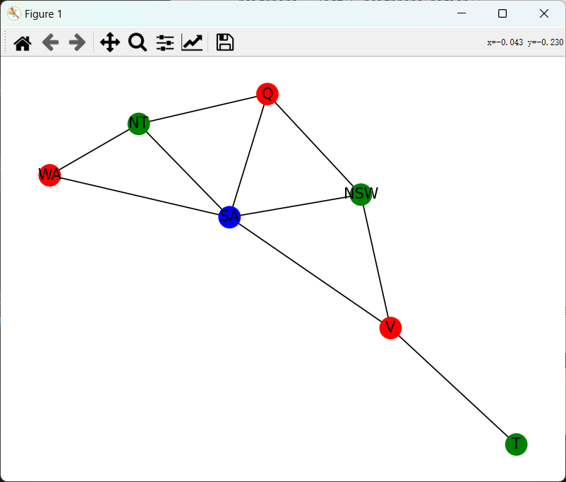

# homework6

## 澳大利亚地图着色问题

这是一个澳大利亚地图着色问题（三色问题），即使用三种颜色给澳大利亚的各个州和领地着色，要求相邻的区域颜色不同。

解决这个问题的步骤如下：

1. 首先，我们可以任意选择一个区域开始着色。假设我们从SA（南澳大利亚州）开始，选择颜色1。
2. 与SA相邻的有WA、NT、Q、NSW和V。这些区域不能使用颜色1，我们可以选择颜色2给NT、Q和NSW着色，选择颜色3给WA和V着色。
3. 最后，T（塔斯马尼亚州）只与V相邻，所以T可以使用颜色2。

一种合法的着色方案由下面代码给出：
```py
import networkx as nx
import matplotlib.pyplot as plt

# 创建一个图来表示澳大利亚各区域的相邻关系
G = nx.Graph()

# 添加节点，对应各个州和领地
regions = ["WA", "NT", "Q", "SA", "NSW", "V", "T"]
G.add_nodes_from(regions)

# 添加边，来表示相邻关系
G.add_edges_from([("WA", "NT"), ("WA", "SA"), ("NT", "Q"), ("NT", "SA"),
                  ("Q", "NSW"), ("Q", "SA"), ("NSW", "V"), ("NSW", "SA"),
                  ("V", "SA"), ("T", "V")])

# 定义三种颜色
colors = ["r", "g", "b"]

# 尝试进行着色，用字典来存储每个区域对应的颜色，初始化为None
coloring = {region: None for region in regions}

# 遍历每个节点（区域）进行着色尝试
for region in regions:
    used_colors = []
    neighbors = list(G.neighbors(region))
    for neighbor in neighbors:
        if coloring[neighbor] is not None:
            used_colors.append(coloring[neighbor])
    for color in colors:
        if color not in used_colors:
            coloring[region] = color
            break

# 输出每个区域的着色情况
for region, color in coloring.items():
    print(f"{region}: {color}")

# 以下代码可以用于可视化展示图及着色情况（可选，需matplotlib支持）
pos = nx.spring_layout(G)
nx.draw(G, pos, with_labels=True, node_color=[coloring[node] for node in G.nodes()])
plt.show()
```
</br>

最终着色结果如下图所示：

</br>

我们可以定义一个递归函数来进行穷举着色，并使用字典存储着色方案，以下是代码：
```py
# 定义一个递归函数来进行穷举着色
def enumerate_colorings(current_region_index, coloring):
    if current_region_index == len(regions):
        all_colorings.append(coloring.copy())
        return
    region = regions[current_region_index]
    used_colors = []
    neighbors = list(G.neighbors(region))
    for neighbor in neighbors:
        if coloring[neighbor] is not None:
            used_colors.append(coloring[neighbor])
    for color in colors:
        if color not in used_colors:
            coloring[region] = color
            enumerate_colorings(current_region_index + 1, coloring)
            coloring[region] = None


# 初始的着色字典，初始化为None
initial_coloring = {region: None for region in regions}
enumerate_colorings(0, initial_coloring)
```

不过这种方法耗时过长，我们借助图的删除 - 收缩定理来计算色多项式
（进而得到用特定数量颜色着色的解的数量），下面是代码：


```python
import networkx as nx

# 计算图G的色多项式在给定颜色数量k处的值
def chromatic_polynomial_value(G, k):
    if G.number_of_nodes() == 0:
        return 1
    if G.number_of_nodes() == 1:
        return k
    # 选择一条边用于删除和收缩操作
    edge = list(G.edges())[0]
    G_copy_delete = G.copy()
    G_copy_delete.remove_edge(*edge)
    G_copy_contract = nx.contracted_edge(G.copy(), edge, self_loops=False)
    # 递归计算删除边后的图和收缩边后的图的色多项式
    return chromatic_polynomial_value(G_copy_delete, k) - chromatic_polynomial_value(G_copy_contract, k)

# 创建一个图来表示澳大利亚各区域的相邻关系
G = nx.Graph()

# 添加节点，对应各个州和领地
regions = ["WA", "NT", "Q", "SA", "NSW", "V", "T"]
G.add_nodes_from(regions)

# 添加边，来表示相邻关系
G.add_edges_from([("WA", "NT"), ("WA", "SA"), ("NT", "Q"), ("NT", "SA"),
                  ("Q", "NSW"), ("Q", "SA"), ("NSW", "V"), ("NSW", "SA"),
                  ("V", "SA"), ("T", "V")])

# 定义颜色数量（这里对应三色问题中的3种颜色）
num_colors = 3
result = chromatic_polynomial_value(G, num_colors)
print(f"使用 {num_colors} 种颜色对该图（澳大利亚地图关系图）着色的解的数量为: {result}")
```

在上述代码中：

1. `chromatic_polynomial_value`函数实现了依据删除-收缩定理来计算色多项式在给定颜色数量`k`处的值的功能。
    - 首先判断了图的节点数量的基础情况，如果节点数为0（空图），则色多项式值为1；如果节点数为1，则色多项式值为`k`（因为单个节点可以用`k`种颜色中的任意一种来着色）。
    - 接着选择图中的一条边，分别构建删除这条边后的图副本`G_copy_delete`以及收缩这条边后的图副本`G_copy_contract`。
    - 然后通过递归调用`chromatic_polynomial_value`函数来分别计算删除边后的图和收缩边后的图的色多项式，并依据删除-收缩定理相减得到当前图的色多项式在给定`k`处的值。
2. 后续代码创建了和之前一样表示澳大利亚各区域相邻关系的图`G`，定义了颜色数量（这里设定为3对应三色问题），最后调用`chromatic_polynomial_value`函数并输出计算得到的使用3种颜色对该图着色的解的数量。

最终结果为
```py
48
```
</br>

## 简答题
**Q：如何通过使用辅助变量把诸如A+B=C这样的三元约束变成三个二元约束。假设值域是有限的。**

A：以下是通过使用辅助变量将诸如 `A + B = C` 这样的三元约束变成三个二元约束的具体方法（假设值域是有限的）：

### 1. 引入辅助变量
引入一个新的变量对 `(X, Y)` 来表示 `A` 和 `B` 这两个变量相关的信息。这里的 `X` 和 `Y` 可以理解为分别承载 `A` 和 `B` 的相关角色。

### 2. 定义二元约束
- **约束一：表示 `X` 是对应变量对中的第一个元素且与 `A` 相关联**
我们定义约束为 `X = A`，这样就建立了新变量 `X` 和原始变量 `A` 的二元关系，表明 `X` 在我们所构建的变量对表示中承担着等同于 `A` 的角色。
- **约束二：表示 `Y` 是对应变量对中的第二个元素且与 `B` 相关联**
定义约束 `Y = B`，从而确立了新变量 `Y` 和原始变量 `B` 的二元联系，意味着 `Y` 在变量对里对应着 `B` 的作用。
- **约束三：基于变量对表示与结果变量 `C` 的关系**
由于我们引入变量对 `(X, Y)` 是为了替代原本 `A` 和 `B` 在 `A + B = C` 这个三元约束中的角色，所以可以定义约束 `X + Y = C`。这个约束利用了前面将 `A` 关联到 `X`、`B` 关联到 `Y` 的关系，间接地把原来关于 `A`、`B`、`C` 的三元约束转化成了关于 `X`、`Y`、`C` 的二元关系（因为 `X` 和 `Y` 已通过前面两个约束分别与 `A` 和 `B` 绑定）。

通过上述三个二元约束（`X = A`、`Y = B`、`X + Y = C`），成功地将原始的三元约束 `A + B = C` 转化成了三个二元约束，并且借助新引入的变量对 `(X, Y)` 来传递各变量之间的关系，前提是所有涉及的变量值域都是有限的。 

 