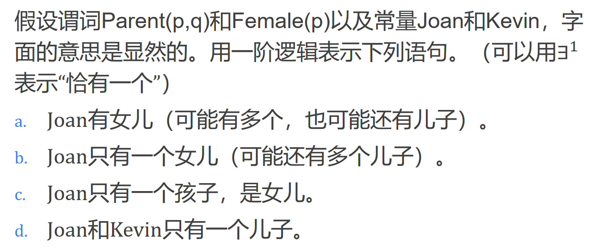

<!--
 * @Author: shysgsg 1054733568@qq.com
 * @Date: 2024-12-14 22:59:28
 * @LastEditors: shysgsg 1054733568@qq.com
 * @LastEditTime: 2024-12-14 23:06:56
 * @FilePath: \人工智能\homework8\homework8.md
 * @Description: 这是默认设置,请设置`customMade`, 打开koroFileHeader查看配置 进行设置: https://github.com/OBKoro1/koro1FileHeader/wiki/%E9%85%8D%E7%BD%AE
-->
# homework8

## 问题一

1. 首先明确题目中给出的谓词和常量的含义：
   - Parent(p, q)表示p是q的父母。
   - Female(p)表示p是女性。
   - Joan和Kevin是常量，表示具体的人。
   - ∃!表示“恰有一个”。
2. 用一阶逻辑表示各语句：
   - a. Joan有女儿（可能有多个，也可能还有儿子）。
     - ∃x (Parent(Joan, x) ∧ Female(x))
   - b. Joan只有一个女儿（可能还有多个儿子）。
     - ∃x (Parent(Joan, x) ∧ Female(x) ∧ ∀y ((Parent(Joan, y) ∧ Female(y)) → (x = y)))
   - c. Joan只有一个孩子，是女儿。
     - ∃x (Parent(Joan, x) ∧ Female(x) ∧ ∀y (Parent(Joan, y) → (x = y)))
   - d. Joan和Kevin只有一个儿子。
     - ∃x (Parent(Joan, x) ∧ Parent(Kevin, x) ∧ ¬Female(x) ∧ ∀y ((Parent(Joan, y) ∧ Parent(Kevin, y) ∧ ¬Female(y)) → (x = y)))

解释：
- 对于a，我们只需要表示存在一个Joan的孩子是女性即可。
- 对于b，我们需要表示存在一个Joan的孩子是女性，并且对于任何Joan的女性孩子，都与这个孩子相同（即只有一个女儿）。
- 对于c，我们需要表示存在一个Joan的孩子是女性，并且对于任何Joan的孩子，都与这个孩子相同（即只有一个孩子且是女儿）。
- 对于d，我们需要表示存在一个Joan和Kevin的孩子是男性，并且对于任何Joan和Kevin的男性孩子，都与这个孩子相同（即只有一个儿子）。
